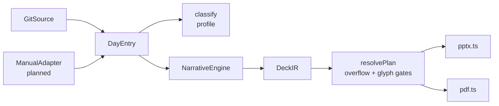

# Repository Guidelines

## Project Overview

**decktective** turns day-to-day activity into a weekly deck, emitted as **PPTX and PDF** from a single intermediate representation (`DeckIR`).

It is a **custom harness agent** (`.omp/agents/decktective.md`) backed by a deterministic generator in `src/`. Dispatch it by name for "weekly report", "weekly deck", or "summarize my commits". `brainstorm.md` holds the design record and the resolved decisions (§7).

Status: **implemented and working end-to-end.** A real repo of 14 commits produces a 10-slide PPTX and a 10-page PDF in ~0.6s.

## Architecture & Data Flow

```
git / manual  ->  DayEntry[]      facts pass, deterministic, numbers frozen
DayEntry[]    ->  Narrative       YOUR pass, only if commit subjects are messy
Narrative     ->  DeckIR          fixed skeleton
DeckIR        ->  RenderPlan      layout resolved ONCE; overflow + glyphs enforced
RenderPlan    ->  PPTX + PDF      dumb emitters, no layout decisions
```

The load-bearing rule: **layout is resolved once, in `src/layout/resolve.ts`, into a backend-agnostic `RenderPlan`.** Emitters translate it and make no layout decisions — that is what stops PPTX and PDF from drifting. `RenderPlan` geometry is in inches; each backend converts once (`IN_TO_PT = 72`, `IN_TO_PX = 96`).



### Sources of truth

- `src/ir/types.ts` — every shared type (`DeckIR`, `Slide`, `Block`, `DayEntry`, `DayMetrics`, `Window`, `SourceAdapter`, `NarrativeEngine`). Read it first.
- `src/render/types.ts` — `RenderPlan` / `DrawOp` contract between resolver and emitters.
- `src/theme.ts` — design tokens, grid math, the only unit conversions.
- `src/layout/spec.ts` — which slots each layout exposes and what block kinds they accept.

## Key Directories

| Path | Purpose |
|---|---|
| `src/ir/` | IR type contract — the one place shared types live. |
| `src/sources/` | `git.ts` adapter, `profile.ts` day classifier, its tests. |
| `src/narrative/` | `template.ts` deterministic engine, `validate.ts` fact-lock gate. |
| `src/layout/` | `spec.ts` slot geometry, `resolve.ts` the resolver + gates. |
| `src/render/` | `types.ts` plan contract, `pptx.ts`, `pdf.ts` emitters. |
| `src/deck/` | `build.ts` — narrative + facts to `DeckIR`. |
| `assets/fonts/` | Bundled Inter TTF (400/700). Required; see conventions. |
| `.omp/agents/` | The harness agent definition. |

## Development Commands

```bash
node src/cli.ts --repo <path> --preset this --out out -y   # this week
node src/cli.ts --repo <path> --preset last --pptx-only -y
node src/cli.ts --repo <path> --start <iso> --end <iso> --tz Asia/Jakarta -y

npx tsc --noEmit        # typecheck (must be clean)
node --test             # all tests (~0.3s)
node --test src/window.test.ts
```

No window given → the CLI probes 12 weeks of commit density, prints a histogram, and asks. The resolved absolute range is always echoed before the expensive pass.

Flags: `--tz` (default `Asia/Jakarta`), `--title`, `--exclude dist/,bun.lock` (comma-separated prefixes removed from churn), `--narrative <file.json>` (agent-written narrative, fact-locked before rendering), `--pptx-only`, `--pdf-only`, `-y`.

Outputs three files sharing a stem: `<date>_<ISO-week>.json` (the IR), `.pptx`, `.pdf`.

## Code Conventions & Common Patterns

**Runtime constraints — these are enforced, not stylistic:**

- **Node >= 26, TypeScript via native type stripping.** Only *erasable* TS: **no enums, no namespaces, no parameter properties, no `declare` fields.** `erasableSyntaxOnly` fails the build. Use `type` unions and plain objects.
- **Always use explicit `.ts` extensions** on relative imports. `moduleResolution: "bundler"` will *not* catch a missing extension, but Node will fail at runtime. See `brainstorm.md` §7.6 for why bundler resolution is configured.
- **No Temporal** in Node 26 — timezone math uses `Intl` (`src/window.ts`).
- **Never add opentype.js.** It throws on Inter's GSUB tables. Measurement uses `fontkit` (already a pdfkit dependency) — see `src/measure.ts`.

**Patterns:**

- **Shape-first layout.** Never hand-place text. A block goes in a layout slot; `spec.ts` owns the rect. `resolvePlan` rejects a block whose kind the slot does not accept.
- **Fail loudly on overflow and tofu.** `OverflowError` and `MissingGlyphError` are features. Text is measured against the bundled font; if it cannot fit (autofit ladder down to 12pt) or a character has no glyph (glyph id 0), the build fails. Never weaken these to make a deck render.
- **Tiny helpers get inlined** (`ts-no-tiny-functions`). Don't publish a contract via `ReturnType<typeof fn>` — name and export the type (`ts-no-return-type`).
- **Pure functions over classes.** `classify(metrics)` is pure and testable without git. Classes exist only where state demands it (`GitSource`).
- **Errors are explicit and named**; messages state the offending value, rect, and text.
- **Never invoke a shell string.** `GitSource` uses `execFile` with an argv array so dates, paths, and pathspecs never reach a shell.

**Data-handling rules:**

- **Commit count and change magnitude are separate axes.** Never collapse them into one number. `DayMetrics` carries both; every day row shows both. A day with 3 commits and +4,120 lines is not the same as one with 34 small commits.
- **Sanitize churn before trusting it.** Exclude vendored/generated/lockfile paths, skip binary entries, detect renames. `--exclude` exists for this.
- **Date attribution can be wrong.** `--since`/`--until` filter on *committer* date while `%ad` is *author* date; squashes move work across days. The adapter buckets on author date and emits a warning on divergence — surface warnings, don't hide them.
- **Fact-lock the narrative.** `assertFactLocked` rejects any numeral not derivable from the facts. ISO dates/offsets are masked as identity. Redact secrets before narrating; default to team-level attribution.

## Important Files

| Path | Role |
|---|---|
| `src/cli.ts` | Entry point: window selection, collection, narration, emit. |
| `src/sources/git.ts` | Git adapter — two-pass `--numstat` collection, warnings, profiles. |
| `src/sources/profile.ts` | Pure `classify()`; all thresholds in `PROFILE_THRESHOLDS`. |
| `src/layout/resolve.ts` | **The keystone.** Layout, autofit, overflow and glyph gates. |
| `src/narrative/validate.ts` | Fact-lock gate (`InventedNumberError`). |
| `src/deck/build.ts` | Fixed skeleton: title → agenda → metrics → per-day → themes → risks → next → appendix. |
| `src/measure.ts` | fontkit measurement, unit-width cache, glyph coverage. |
| `brainstorm.md` | Design record; §7 = resolved decisions. |
| `.omp/agents/decktective.md` | Harness agent definition. |

## Runtime/Tooling Preferences

- **Node >= 26** (`engines` in `package.json`), npm, ESM (`"type": "module"`).
- `@types/node` is pinned to the **`ts6.0` dist-tag** (26.5.1). `@types/node@latest` resolves to Node **22** typings and is wrong here.
- TypeScript 7, `module: "preserve"`, `moduleResolution: "bundler"` — required by pptxgenjs's broken UMD typings; rationale in `brainstorm.md` §7.6.
- `tsconfig` is maximally strict: `strict`, `noUncheckedIndexedAccess`, `verbatimModuleSyntax`, `erasableSyntaxOnly`.
- Runtime deps: `pptxgenjs`, `pdfkit`, `satori`, `@resvg/resvg-js`, `pdf-lib`. `fontkit` comes via pdfkit.
- Fonts are **bundled** at `assets/fonts/` (real TTF, not WOFF). The machine has no system fonts, and the Inter latin subset omits some symbols — do not introduce new glyphs without checking coverage.
- `pdftotext` / `pdftoppm` / `pdfinfo` are available for verification.

## Testing & QA

`node --test` with `node:test` + `node:assert/strict` (no jest/vitest). Tests are fast (~0.3s) and offline — **no git repo or model required**.

Coverage today (35 tests):

- `src/sources/git.test.ts` — the pure classifier: every profile reachable, precedence, zero-division safety.
- `src/window.test.ts` — half-open boundaries, Monday edges, cross-timezone offsets, presets.
- `src/pipeline.test.ts` — fact-lock rejections, overflow + glyph gates, plan construction.

What to test: behavior and invariants (a number must be rejected; text that cannot fit must throw), not plumbing. Inject `TemplateNarrative` for determinism — model-written prose is not byte-reproducible, but numbers, dates, refs, slide count, and layout are.

Verify deck output by reading the artifacts, never by assuming success:

```bash
node src/cli.ts --repo /path --preset last --out /tmp/deck -y
pdftotext /tmp/deck/*.pdf -            # real text, numbers match the IR
read /tmp/deck/*.pptx                  # text is editable, not image-only
pdftoppm -png -r 72 /tmp/deck/*.pdf /tmp/deck/page   # then inspect visually
```

**Text extraction alone is not enough.** A missing glyph extracts as valid text but renders as tofu — visual inspection of a rendered page is required when touching fonts, glyphs, or string constants.

The `TZ` used for a run governs day bucketing; set `--tz` explicitly or "Monday" is wrong by hours.
