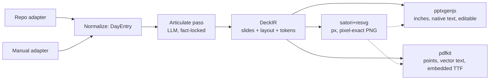

# Weekly Deck Harness — Brainstorm & Design Notes

> Goal: a custom harness agent that turns day-to-day activity into a weekly deck,
> emitted as **PPTX and PDF**.
> Status: pre-implementation. Environment probed, architecture drafted, decisions open.

---

### Consequences that shape everything

1. **"Build a PPTX then export PDF" is impossible here** — no LibreOffice, broken Chromium.
   → PDF must be produced **independently from the same source model**.
2. That forces an **intermediate representation (IR)**. Good news: the IR is also what
   makes layout deterministic and testable.
3. **No system fonts + WOFF rejected by opentype.js** → bundle real **TTF** files
   (fetch from CDN at setup, cache in repo).

### Reproduce the probes

```bash
mkdir -p /tmp/pptxtest && cd /tmp/pptxtest
bun add pptxgenjs pdfkit pdf-lib satori @resvg/resvg-js

# fonts (satori/opentype.js need static TTF, NOT woff)
bun -e '
const g = async u => Buffer.from(await (await fetch(u)).arrayBuffer());
await Bun.write("inter400.ttf", await g("https://cdn.jsdelivr.net/fontsource/fonts/inter@latest/latin-400-normal.ttf"));
await Bun.write("inter700.ttf", await g("https://cdn.jsdelivr.net/fontsource/fonts/inter@latest/latin-700-normal.ttf"));
'
```

Minimal satori → SVG → PNG:

```js
import satori from "satori";
import { Resvg } from "@resvg/resvg-js";
import fs from "node:fs";

const h = (t, p, c) => ({ type: t, props: { style: p, children: c } });
const tree = h("div", {
  width: "1280px", height: "720px", display: "flex", flexDirection: "column",
  padding: "48px", backgroundColor: "#fff", fontFamily: "Inter",
}, [
  h("div", { fontSize: "44px", fontWeight: 700, color: "#111" }, "Weekly Deck Smoke"),
  h("div", { fontSize: "20px", color: "#555", marginTop: "16px" }, "Commits Mon 4 / Tue 7 — body ABC 123"),
]);

const svg = await satori(tree, {
  width: 1280, height: 720,
  fonts: [
    { name: "Inter", data: fs.readFileSync("inter400.ttf"), weight: 400, style: "normal" },
    { name: "Inter", data: fs.readFileSync("inter700.ttf"), weight: 700, style: "normal" },
  ],
});
fs.writeFileSync("slide.svg", svg);
fs.writeFileSync("slide.png", new Resvg(svg, { fitTo: { mode: "width", value: 1280 } }).render().asPng());
```

---

## 1. Architecture: one IR, three backends



**`DeckIR` is the product.** Emitters are dumb. This is the only way to keep PPTX and
PDF from silently drifting.

### Draft types

```ts
type DeckIR = {
  meta: { title: string; week: string; tz: string; generatedAt: string };
  theme: Theme;                       // tokens: colors, font families, spacing scale
  slides: Slide[];
};

type Slide = {
  layout: LayoutId;                   // "title" | "bullets" | "metrics" | "timeline" | ...
  slots: Record<string, Block>;       // slot keys are layout-defined
  notes?: string;
  evidence?: Evidence[];              // commit hashes → clickable appendix
};

type DayEntry = {
  date: string;                       // YYYY-MM-DD in declared TZ
  source: "git" | "manual";
  items: {
    text: string;
    kind: "feat" | "fix" | "refactor" | "chore" | "docs";
    refs?: string[];                  // commit SHAs / PR ids
    additions?: number;
    deletions?: number;
    files?: number;
  }[];
  metrics: { commits: number; additions: number; deletions: number; filesTouched: number };
};
```

`DayEntry` is the **cache / watermark unit** — one JSON per day. The git adapter fills
it, the manual adapter fills it, both produce an identical shape.
**Weekly deck = fold of 7 days.**

---

## 2. Input modes

### 2a. Repo mode

Window detection is the trap. Working recipe:

```bash
TZ=Asia/Jakarta git log \
  --since="2026-09-07T00:00:00+07:00" --until="2026-09-14T00:00:00+07:00" \
  --date=iso-strict-local --pretty=format:'%H|%ad|%cd|%an|%s' --no-merges
```

Pitfalls to bake in, not discover later:

- `--since/--until` filter on **committer** date; `%ad` is **author** date.
  Cherry-picks/rebases skew them apart → emit both, filter in code on the field you mean.
- `--date` respects process `TZ`. Set `TZ` explicitly or "Monday" is wrong by hours.
- Half-open window `[Mon 00:00, next Mon 00:00)` in **one declared TZ**.
  Never "last 7 days" silently.
- Branch selection: `--first-parent <default-branch>` for a real weekly report;
  `--all` counts rebased duplicates.
- Shallow clones (`--depth=1`) silently return partial history → detect `.git/shallow`, warn.
- Merge commits: `--no-merges` by default; count them separately as a metric.
- Churn needs a second pass: `--numstat` (skip binary `-`), `-w` if whitespace noise matters.
- Vendored/generated dirs → path filter/exclude list, else churn numbers are lies.
- Don't clone into the session dir; use a cache dir + `git fetch --prune`, reuse the clone.

Per-day grouping (verified):

```bash
git log --since=2026-09-07T00:00:00 --until=2026-09-11T00:00:00 \
  --date=short --pretty=format:'%ad|%h|%s' \
| sort | awk -F'|' '{d[$1]++; print} END{print "--- per-day counts ---"; for(k in d) printf "%s %d\n", k, d[k]}'
```

### 2b. Manual mode

Same `DayEntry` shape, no repo. Needs a fast capture format:

- One-liner per item: `2026-09-09 | feat | shipped pptx emitter | #PR-12`
- Or freeform blob → LLM extract into `DayEntry[]` → **show the parsed table back for
  confirmation** before rendering. Confirmation gate matters: garbage-in reaches the deck otherwise.
- Window selection identical (declared Mon–Sun + TZ) so both modes converge on the same fold.

### 2c. Articulation stage (both modes) — fact-locked two-pass

Split hard:

1. **Facts pass (deterministic):** git/manual → `DayEntry[]`. No LLM.
   Numbers, dates, hashes are immutable here.
2. **Narrative pass (LLM, schema-constrained):** in-harness `completion()` with a JSON
   schema → per item: rewritten title (≤ 60 chars, verb-led), `kind` classification,
   theme clustering, dedupe of near-identical commits, one "headline" per day,
   week summary, risks/blockers, next-week focus.

**Guardrail:** LLM receives facts as read-only context; a validator rejects any output
containing a number not present in the facts (regex diff against source `DayEntry`).
Every narrated item keeps `refs: [sha]` for traceability.
This is what stops a plausible-sounding deck from inventing "27% faster".

---

## 3. Layout decisioning (point 2 in the original brief)

**Shape-first, LLM-second.** Never ask an LLM to place text at coordinates — it will be
wrong and unverifiable.

1. **Classify content shape** (rules):
   `0 items` → skip · `1 metric row` → metrics · `N ≤ 6 bullets` → bullets ·
   `≥ 7` → split or two-col · date-ordered with deltas → timeline ·
   before/after → compare · single big number → hero.
2. **Layout = f(shape, slot capacity)** — a static table.
   LLM may only *rank* among layouts allowed for that shape; validator falls back to the
   default if it picks outside the set.
3. **Grid + one token table:**
   - canvas 13.333 × 7.5 in (16:9)
   - 12 columns × 7 rows, 0.6 in margin, 0.2 in gutter
   - body ≥ 18 pt, title 28–32 pt, max 6 bullets, max 7 words/bullet
   - convert once: **inches** (pptxgenjs) / `in × 72` **pt** (pdfkit) / `in × 96` **px**
     (satori at 1280×720)
4. **Overflow is measured, not hoped.** satori can measure text → autofit ladder:
   shrink font one step → condense text → split slide → move to appendix.
   Validate every slide post-build (`bbox ⊂ safe area`) and fail the build loudly.
5. **Fixed skeleton, variable bodies:**
   title → agenda → headline metrics → per-day → themes → risks/blockers →
   next week → appendix (evidence table with hashes).
   Deliberately boring = consistent week to week, which is what a weekly deck is for.
6. **Fonts:** bundle TTF (CDN fetch at setup, cached in repo) because the box has zero
   fonts and WOFF is rejected. PPTX/PDF only need the font *name* for viewers, but you
   need the real TTF for measurement and for pdfkit embedding.

---

## 4. Other possibilities worth deciding on now

| Idea | Value | Cost |
|---|---|---|
| **Session-log source**: harness writes `~/.omp/logs` + `~/.omp/agent` — real day-to-day activity, not just commits | high — literally "daily activity" | low |
| **Other sources**: GitHub/GitLab API (PRs/reviews/issues), Jira/Linear, Slack, calendar, shell history | medium-high | medium, auth tokens |
| **Evidence appendix + links** to commits/PRs | high trust | low |
| **Auto charts**: commits/day bars, churn, per-repo split (SVG → resvg) | high | medium |
| **Idempotent day cache + watermark SHA** → "since last deck" slide, re-render without re-reading, week-over-week diff | high | low |
| **Template mode**: fill a corporate `.pptx` by editing slide XML via `jszip` | high for adoption | high — pptxgenjs can't read templates |
| **One IR → many outputs**: Slack digest, Markdown/Confluence, email HTML | medium | low — emitters are cheap |
| **Quality gates**: overflow check, contrast check, spelling, LLM "reviewer" pass over the IR | high — prevents embarrassing decks | low |
| **Redaction pass**: scrub secrets/tokens/emails from commit messages before anything hits an LLM | must-have | low |
| **Delivery automation**: cron/systemd or a harness process → Slack/email/Drive | medium | low-medium |
| **Notes + speaker script** per slide | medium | low |
| **Localization** (EN/ID) and strict per-TZ dating | medium | low |
| **Attribution caution**: per-person commit stats are politically loaded — default to team-level | — | — |

---

## 5. Open decisions

1. **PPTX fidelity vs editability** — **resolved, see §7.5**
   **Native editable text** (pptxgenjs), raster PNGs only for charts and hero slides.
   Image-only slides look identical in both outputs but nobody can edit them and file
   size balloons.
2. **Window** — **resolved, see §7.2**
   A selectable `Window` value object. ISO week Monday 00:00 → next Monday 00:00 in one
   declared TZ, half-open, is the **default preset** — not a hard-coded rule. The user
   selects against a probed density histogram.
3. **Narrative engine** — **resolved, see §7.3**
   Hybrid: deterministic conventional-commit parsing first; in-harness LLM behind a
   `NarrativeEngine` interface for the messy remainder, clustering, and weekly prose.
   `TemplateNarrative` fallback keeps the tool offline-capable and tests deterministic.
4. **v1 scope** — **resolved, see §7.4**
   Single git repo in v1, but the pipeline takes `SourceAdapter[]` from day one. Manual
   input is just another adapter and can ship in v1 at ~zero cost.

---

## 6. Next steps

1. ~~Lock decisions 1–4.~~ **All four locked** — see §7.
2. Write the `DeckIR` schema + `Theme` token type, plus `Window`, `DayMetrics`,
   `SourceAdapter`.
3. Build the commit-profile classifier and its threshold table (§7.1).
4. Build the window picker: density probe → histogram → `ask()` → confirm (§7.2).
5. Build the first **vertical slice**: repo → 7-day fold → 5-slide PPTX **and** PDF.
6. Add the validation gate (bbox inside safe area, no invented numbers) (§7.3).
7. Then: manual adapter, charts, cache/watermark, delivery.

---

## 7. Resolved decisions (2026-09-11)

### 7.1 Commit count vs. change magnitude

**Problem.** Commit count and change size disagree, and either alone misreports the week.

```
Day A: 34 commits   +210 /  −190    12 files   → looks busiest by count
Day B:  3 commits  +4120 /  −380    41 files   → looks biggest by churn
```

Neither is wrong; they measure different axes. **Never collapse them into one scalar.**

**Decision: measure several independent dimensions, classify the day profile, let the
profile drive layout + narration, and report both axes so the mismatch stays visible.**

```ts
type DayMetrics = {
  commits: number;
  additions: number; deletions: number;
  filesTouched: number;
  grossChurn: number;       // additions + deletions
  netChurn: number;         // additions − deletions (signed: + builds, − removes)
  concentration: number;    // grossChurn / max(filesTouched, 1)
  medianCommitSize: number;
  maxCommitShare: number;   // largest commit's churn / grossChurn
};
```

**Sanitize churn before trusting it** — "few commits, big changes" is usually one of four
things, and three are lies:

1. Exclude vendored / generated / lockfile / minified paths before computing churn. One
   `bun.lock` or `dist/` rebuild otherwise dwarfs real work.
2. `--numstat` second pass; skip binary entries (`-`).
3. Rename detection (`-M`), else a moved file reads as +500 / −500.
4. Detect aggregated commits: `committer date ≫ author date`, or a merge whose single
   parent carries the bulk of the churn → **date attribution is unreliable, flag it**.
5. Optional whitespace suppression (`-w`) — report both numbers, never silently pick one.

**Classifier** (one tunable block, in the same spirit as the layout table):

| Profile | Condition | Meaning |
|---|---|---|
| `quiet` | `commits == 0` | skip the slide |
| `heavy` | `commits ≤ 3 && (grossChurn ≥ 800 \|\| concentration ≥ 120)` | few commits, big change |
| `drop` | `maxCommitShare ≥ 0.6 && grossChurn > 500` | one commit dominates — squash / vendor / migration; verify before narrating |
| `rename` | `grossChurn > 200 && \|additions − deletions\| / grossChurn < 0.15` | move, not work |
| `burst` | `commits ≥ 8 && medianCommitSize ≤ 60 && maxCommitShare < 0.35` | many small incremental commits |
| `scattered` | `filesTouched ≥ 25 && concentration < 40` | broad but shallow |
| `steady` | otherwise | normal |

Layout follows the profile exactly as shape drives layout: `heavy` / `drop` → hero or
metrics (one big number, plus a "verify" affordance); `burst` → timeline or bullets
(frequency); `scattered` → per-area split. Every day row on the metrics slide shows
**both** commits and churn so the mismatch is legible rather than hidden.

**This also fixes squash merges.** A squashed branch makes one day look huge and the real
work invisible. Because the week has a cross-day *themes* slide, clustered work is
attributed to its theme instead of a fake commit date. Squash handling and multi-day-theme
handling are the same problem — solved once, at week level.

**Narration rule.** Per-day headline is chosen by a `log1p`-compressed significance score
over both axes, so one giant day cannot dominate the week. The LLM may rank *within* a
day's items; it may not choose the metric.

### 7.2 Window selection UX

The window is **not** hard-coded to ISO week. ISO week is the default *preset*.

```ts
type Window = { start: string; end: string; tz: string };  // ISO 8601 + offset, half-open [start, end)
```

Flow (harness `ask()`; the resolved range is always shown before collecting):

1. **Probe density** — one cheap call over ~12 weeks:
   `TZ=$TZ git log --since="12 weeks ago" --date=short --pretty=format:'%ad' | sort | uniq -c`
   (counts only; the expensive `--numstat` pass runs only for the chosen window).
2. **Show it** as an ASCII per-week histogram, so the user selects against real data.
3. **Ask** — presets (this week / last week / last 4 weeks), custom start+end, or a typed
   manual range.
4. **Echo the resolved absolute half-open window with offset and TZ**, then confirm.

Manual mode uses the same picker; with no entries yet it falls back to presets with a
visible default.

**Perf property:** the day cache is keyed `(sourceId, date, tz)`, so changing the window
only computes missing days. Window re-selection is free after the first run.

### 7.3 "Narrative engine", stated plainly

It is **the component that turns facts into words**: per-item titles, kind classification,
dedupe, theme clusters, per-day headlines, week summary, risks, next-week focus. It sits
between the adapters and `DeckIR`.

| Option | Pros | Cons |
|---|---|---|
| **A. None (deterministic)** — parse `feat:` / `fix:`, template the text | offline, free, byte-reproducible, trivially testable | helpless on messy history (`wip`, `asdf`, `fix tests`); no clustering; no weekly prose |
| **B. External API** | best prose | API key, cost, secret management, repo-content egress, one more failure mode |
| **C. In-harness `completion()`** (original rec) | no key, no SDK, no cost config; schema-constrained JSON | couples the builder to running inside the harness |
| **D. Hybrid — chosen** | deterministic first, LLM only for the remainder + clustering + prose | slightly more code |

**Decision: D, with the LLM behind an interface and C as its implementation.**

```ts
interface NarrativeEngine {
  narrate(facts: DayEntry[], window: Window): Promise<Narrative>;
}
// LlmNarrative      → harness completion(), JSON schema
// TemplateNarrative → no model; deterministic fallback
```

So the "narrative engine" is just a **pure function `facts → narrative`**; swapping the
implementation changes nothing downstream.

**Fact-lock (validation contract):**

- The LLM receives facts as read-only context; it may only rewrite, classify, cluster,
  rank.
- A validator extracts every numeral from the output and rejects any not present in the
  source `DayEntry` (or computed from two known numbers). Reject → retry → fall back to
  `TemplateNarrative`.
- Every narrated item keeps `refs: [sha]`.
- Redaction runs **before** anything reaches the LLM.

**Determinism, precisely.** Prose will not be byte-identical across LLM runs; the
*invariants* are — numbers, dates, refs, slide count, layout. Tests and CI use
`TemplateNarrative`, so the IR and emitters stay fully deterministic without a model.
LLM output quality is a separate, non-blocking check.

### 7.4 v1 scope: single repo, array-shaped from day one

v1 targets **one git repo**, but no code assumes it.

```ts
interface SourceAdapter {
  readonly id: string;                                  // "my-repo" | "manual"
  collect(window: Window, opts: CollectOpts): Promise<DayEntry[]>;
}
```

- Pipeline input is `SourceAdapter[]`; v1 passes a one-element array. The CLI takes a
  single `--repo` path and wraps it internally.
- `DayEntry` carries `sourceId`; the cache file is one JSON per `(sourceId, date, tz)` —
  the key already includes it.
- Week fold = group by date, concat across sources. **No change to fold, IR, or emitters.**
- The per-repo split slide appears only when `distinct sourceIds > 1`, so single-repo
  output is byte-unchanged.
- Manual input is simply another adapter, so **repo + manual is available in v1 at almost
  zero cost** — it is orthogonal to repo count. Worth taking.

Multi-repo later = pass more adapters. That is the entire diff.

### 7.5 PPTX fidelity — native editable text

**Resolved.** pptxgenjs emits real editable text. Raster PNGs are used **only** for
charts and the hero graphic, never for body copy: image-only slides look identical in
both outputs but nobody can edit them and the file size balloons. Since both backends
render the same `RenderPlan`, PNG ops are shared by design — one raster, two decks.

### 7.6 Runtime: Node 26, and the tsconfig consequence

**Probed, not assumed.** Bun is not installed on this machine (no `~/.bun/bin`, not on
PATH), yet every command in §"Reproduce the probes" assumes it. Node v26.0.0 is present
with native TypeScript type stripping (`process.features.typescript === "strip"`).

**Decision: standardize on Node >= 26.** No system-level install. `node --test` runs
`.ts` files directly (verified), so no test-runner dependency is needed either.

Consequences that bind the codebase:

- **Erasable-only TypeScript.** Type stripping cannot transform enums, namespaces,
  parameter properties, or `declare` fields. `erasableSyntaxOnly` enforces this.
  Use `type` unions and plain object literals.
- **Explicit `.ts` extensions** on relative imports (`allowImportingTsExtensions`).
- **No Temporal.** Node 26 does not expose it, so timezone math uses `Intl`
  (`src/window.ts`) rather than `Temporal.ZonedDateTime`. Sufficient and dependency-free.
- **`@types/node` needs the `ts6.0` dist-tag.** `@types/node@latest` resolves to Node 22
  typings (22.20.2); the Node 26 typings are published under `ts6.0` (26.5.1).
- **No opentype.js.** It throws on Inter's GSUB tables
  (`substitutionType: 62 lookupType: 6 substFormat: 2 is not yet supported`).
  Measurement uses **fontkit**, which pdfkit already depends on, parses these fonts
  correctly, and exposes `layout().advanceWidth`. Advance widths are font-intrinsic,
  so the same numbers serve the PPTX backend.

**`moduleResolution: "bundler"` + `module: "preserve"`** — this looks wrong for a
Node-executed project, so recording the reason. pptxgenjs 4.0.1 (still latest) ships a
**UMD `.d.ts`** (`export as namespace` + `export default`) on a CommonJS package with no
`"type": "module"`. Under `moduleResolution: "nodenext"` TypeScript binds the default
import to the module *namespace object*, which is not constructable and exposes no
`Slide` / `TextProps` / `TextPropsOptions` members. Verified failures, all of them:
plain default import, `* as NS` + `NS.default`, `esModuleInterop`, `allowUmdGlobalAccess`,
and a local `declare module` shim. Only bundler resolution resolves it.

Tradeoff accepted: bundler resolution also permits extensionless relative imports, which
`tsc` would accept but Node would reject at runtime. **Keep explicit `.ts` extensions** —
that is now a convention with teeth, not a style preference. The alternative (a
hand-written declaration re-stating pptxgenjs's API surface) duplicates a third-party
interface and drifts; this is one config line and no duplication.
